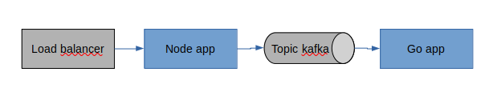
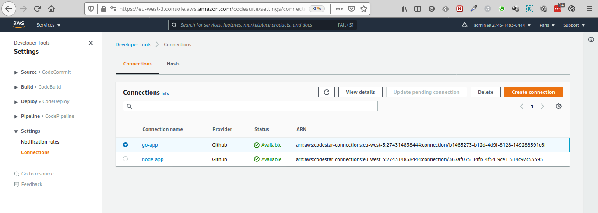
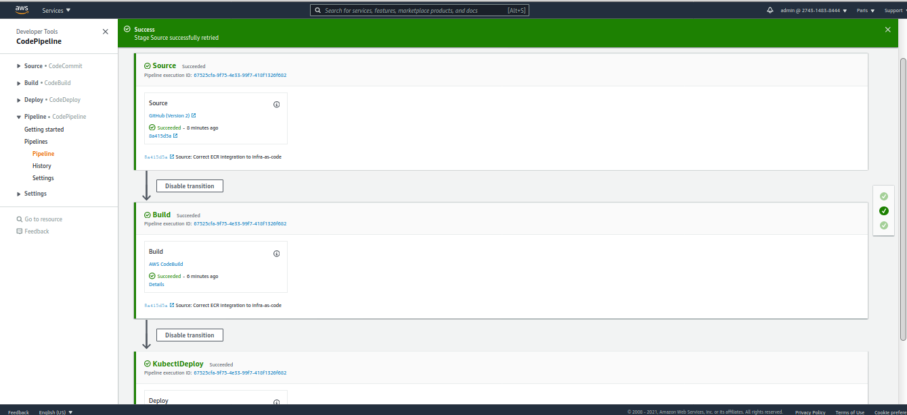
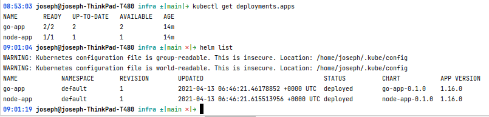
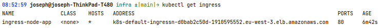
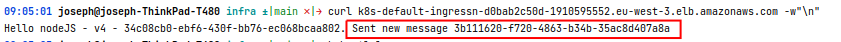
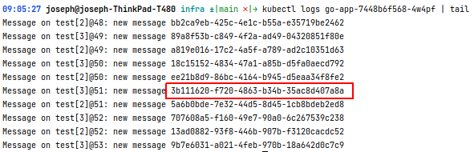

# Polyglot Microservices, #1

:fr: Sommaire / :gb: Table of Contents
=================

<!--ts-->

- [:fr: Description du projet](#fr-description-du-projet)
  - [Lancement](#lancement)
  - [Pièges rencontrés](#piges-rencontrs)
  - [Prochaines étapes](#prochaines-tapes)
- [:gb: Project Description](#gb-project-description)
  - [Launching](#launching)
  - [Encountered Traps](#encountered-traps)
  - [Next Steps](#next-steps)

---

# :fr: Description du projet

Le but de ce projet est de s'essayer à implémenter un microservice "polyglotte": 

- 1 service en `NodeJS`
- 1 service en `Go`

Le service `NodeJs` expose un endpoint REST et produit des events dans un topic Kafka (on utilise la solution d'AWS `MSK`) à chaque appel.

Le service `Go` consomme les events et les affiche dans la console.

Les services tournent dans un cluster Kubernetes managé par AWS ("EKS"), avec la pipeline de déploiement CI/CD correspondante.

Tout est créé "en un seul click".

## Lancement

1. Forker le repo 
2. Dans `infra/infra.env`, renseigner la variable `GITHUB_REPO` avec la valeur correspondant au repo forké 
3. Ajouter une paire de clés ssh dans votre compte AWS 
4. Dans `infra/infra.env`, renseigner la variable `BASTION_HOST_KEY_NAME` avec le nom de la paire de clés ssh  
5. Se déplacer dans `infra`
6. Créer l'infra via `./create-infra.sh $infra-name`
7. Activez les connexions github pour les pipelines des microservices node et go

   
8. sur les 2 pipelines des applications node et go, relancez une release ou réessayez le stage "Source", vous devriez avoir une pipeline verte au final

   
9. vérifiez que les déploiements Kubernetes sont bien créé

   
10. vérifiez que l'ingress du service associée à l'application node est up, et récupérez son url publique

    
11. lancez un curl sur cette url et récupérez l'id de l'event Kafka envoyé

    
12. en attendant que l'aggrégation de logs soit en place, récupérez les logs de chacun des pods et vérifier que l'id de l'event Kafka y figure bien.

On notera qu'il y a beaucoup d'autres logs, ceux-ci sont dûs aux requêtes de health check du target group du load balancer associé à l'ingress, qui provoque aussi des envois d'events Kafka.
    
Félicitations, toute l'infra, les pipelines, les applis et les déploiements fonctionnent parfaitement, et on a une bonne base pour commencer à itérer dessus. 
13. Supprimer l'infra via `./delete-infra.sh $infra-name`

## pièges rencontrés

- il faut abréger le nom des rôles dans la configMap aws-auth
  - [https://github.com/kubernetes-sigs/aws-iam-authenticator/issues/268](https://github.com/kubernetes-sigs/aws-iam-authenticator/issues/268)
  - et la documentation n'aide pas: [https://aws.amazon.com/premiumsupport/knowledge-center/eks-api-server-unauthorized-error/](https://aws.amazon.com/premiumsupport/knowledge-center/eks-api-server-unauthorized-error/)
  
## Prochaines étapes

- Mise en place du mutual-TLS pour les communications entre le cluster Kafka et les clients node et go
- Déplacer chaque microservice dans son propre repo git ou voir si une fonctionnalité côté git ou AWS permet de ne pas déclencher la pipeline du service node si le commit n'est pas sur ce composant. Idem pour le service go
- Mise en place de l'observabilité: 
  - aggrégation des logs
  - collecte de métriques
  - tracing
- Voir la suite après

# :gb: Project Description

The goal of this project si to try to implement a "polyglot" microservice:

- 1 service in `NodeJS`
- 1 service in `Go`

The `NodeJs` service exposes a REST and produces events in a `Kafka` topic every time the API is called (we use the AWS MSK managed service for that purpose).

The `Go` service consumes the events and displays them in the console.

The services run in a `Kubernetes` cluster, managed by AWS (we use a `Fargate` backed EKS cluste), along with the corresponding CI/CD pipeline.

Everything is created in a "single click" fashion.

## Launching

1. Fork the repo
2. In `infra/infra.env`, set the variable `GITHUB_REPO` with the value corresponding to the forked repository
3. Add an ssh key pair in you AWS account
4. In `infra/infra.env`, set the `BASTION_HOST_KEY_NAME` variable with the name of the key pair created in step 3 (or an existing one)
5. go to `infra` directory
6. Create the infrastructure with `./create-infra.sh $infra-name`
7. Activate github connections for node and go microservices
   
   
8. on both pipelines, start a new release or retry the "source" stage. You should have a green pipeline in the end
   
   
9. verify that Kubernetes deployments are created
   
   
10. verify that the ingress associated with the node service is up, and get its public URL back
    
    
11. execute a curl command on this URL and get the id of the sent Kafka message
    
    
12. until logs aggregation is set up, get the logs of both go app pods and verify that the id of the kafka message is indeed present
    
    
We will notice that there are many other logs, they are from the target group health check request, associated to the load balancer of the ingress, which causes many other logs. But that not much important at the moment and for the scope of this pet project.

Congratulation, all the infra, the pipelines, the apps and the deployments work perfectly, and it's a good base to start iterating on.
13. Delete the infrastructure with `./delete-infra.sh $infra-name` 

## encountered traps

- we have to abbreviate the name of the roles in the aws-auth configMap
  - [https://github.com/kubernetes-sigs/aws-iam-authenticator/issues/268](https://github.com/kubernetes-sigs/aws-iam-authenticator/issues/268)
  - and the documentation does not help: [https://aws.amazon.com/premiumsupport/knowledge-center/eks-api-server-unauthorized-error/](https://aws.amazon.com/premiumsupport/knowledge-center/eks-api-server-unauthorized-error/)

## Next Steps

- Setup mutual-TLS for communications between the kafka cluster on one side, node and go service on the other side
- Move each microservice in its own repository or figure out is there is a feature on AWS or git side that allows the node pipeline not to be triggered if the commit is not related to the node service. Same with the go service
- Setup observability:
  - logs aggregation
  - metrics collection
  - tracing
- Figure out next step afterwards